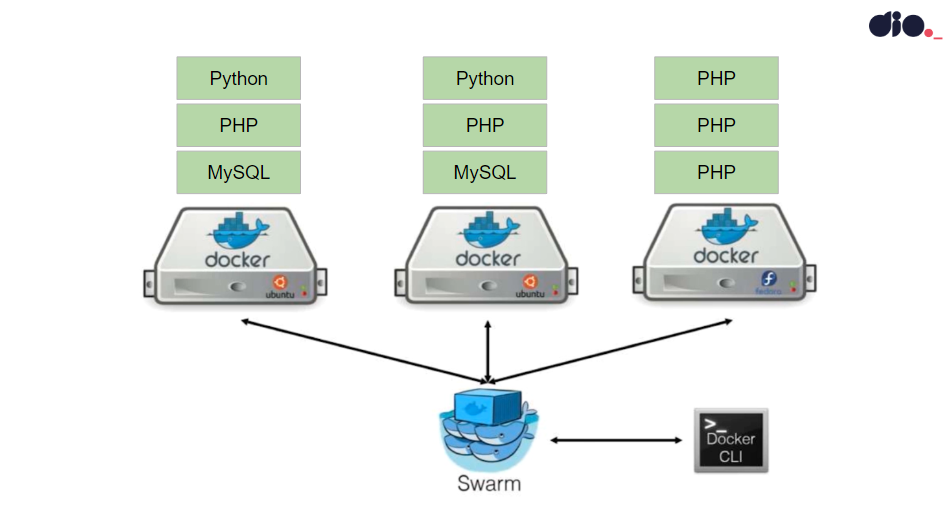
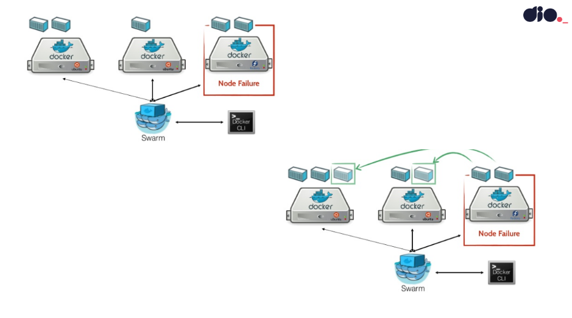

IVAN WAGNER

# Docker: Utilização prática no cenário de Microsserviços
_Denilson Bonatti, Instrutor - [Digital Innovation One](https://web.dio.me/home)_

Muito se tem falado de containers e consequentemente do Docker no ambiente de desenvolvimento. Mas qual a real função de um container no cenários de microsserviços? Qual a real função e quais exemplos práticos podem ser aplicados no dia a dia? Essas são algumas das questões que serão abordadas de forma prática pelo Expert Instructor Denilson Bonatti nesta Live Coding. 

- **Pré-requisitos:** Conhecimentos básicos em Linux, Docker e AWS.

## Conceitos
### Microsserviços
Construir aplicações desmebrando-as em serviços independentes
- Uso de APIs para comunicação
- Possibilidade de escalabilidade

### Cluster
Computadores ligados que trabalham em conjunto. Podem ser considerados como um único sistema.
- Cada computador de um cluster é um Nó.

### Docker Swarm
Recurso do Docker que fornece funcinalidades de orquestração de contêiner.

## Links
[Slides](https://docs.google.com/presentation/d/1rbO_4NZBPh-nzRfuqZyz7bfjfKgNAzLn9OtB9raRAKo/edit#slide=id.p1)